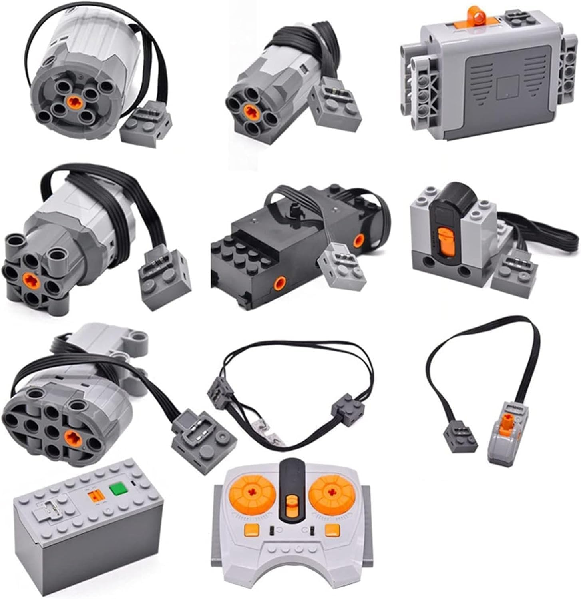
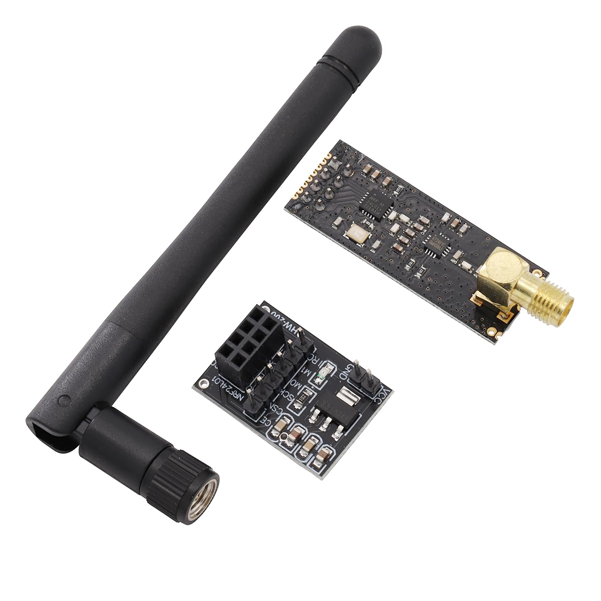
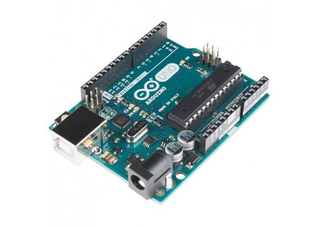

# Hardware

The parts used to reverse-engineer and control the clone. Product info + images are mirrored here
so the project stays documented even if the shop links go offline.

---

## 1. The target — Chinese LEGO Power Functions clone (controller + receiver)

- **Listing:** "Karriter / Hcyx — Compatible con LEGO Technic Motor L Power Functions Building Set,
  11 Piezas … Motor Battery **IR** Remote Receiver Set"
- **Where:** Amazon.es — [`B09X36SQYN`](https://www.amazon.es/dp/B09X36SQYN)
- **11-piece set:** M / L / XL / train / servo motors, 2 battery boxes, a light/extension cable, a
  **2-wheel speed remote** (clone of LEGO **8879**), a power switch, and the **receiver** (clone of
  LEGO **8884**: 2 outputs A/B, a 1–4 channel switch).
- ⚠️ **The listing says "IR" but it is actually 2.4 GHz RF (XN297)** — genuine LEGO PF is infrared;
  this clone replaced the IR PHY with an RF one. Decoding that RF protocol is the whole point of
  this repo (see [`protocol-notes.md`](protocol-notes.md) and [`channels.md`](channels.md)).

---

## 2. The radio — NRF24L01+PA+LNA module + adapter

- **Listing:** "Heevhas — NRF24L01+PA+LNA Módulo transceptor de RF con antena SMA 2,4 GHz 1100 m +
  Placa adaptadora de ruptura"
- **Where:** Amazon.es — [`B0D8Q6JYLW`](https://www.amazon.es/dp/B0D8Q6JYLW)
- **In the box:** 2× NRF24L01**+PA+LNA** transceiver modules, 2× SMA whip antennas, and an
  **AMS1117 breakout adapter** (silkscreen "YL-200" / "NRF24L01", with a 3.3 V regulator).
- **Specs:** 2.400–2.4835 GHz ISM band, GFSK, up to 2 Mbps (we use **1 Mbps**), 126 channels,
  external **PA (+~20 dBm)** + **LNA**, ~1 km line-of-sight, **3.3 V** logic.
- **Role:** the radio. The NRF24L01+ can *emulate XN297* in software, so this same module is used
  both to **sniff** the clone and to **transmit** to it.
- **Power note:** power the **adapter** from **5 V** (its regulator drops to 3.3 V for the module).
  The PA draws ~100 mA current spikes when transmitting; a 10–100 µF decoupling cap across the
  module's VCC/GND helps for range/reliability (works at close range without it).

---

## 3. The brain — Arduino Uno R3

- **Where:** BricoGeek — [Arduino UNO R3](https://tienda.bricogeek.com/arduino/305-arduino-uno-r3.html) (~€24–29)
- **Specs:** ATmega328, 16 MHz, 32 KB flash, 2 KB RAM, 1 KB EEPROM, USB, OptiBoot bootloader.
- **Role:** drives the NRF24L01 over SPI and runs the sketches (`arduino/sniffer`, `arduino/lego_tx`).
  It's a USB-serial bridge: the computer's web app sends commands over USB → the Uno transmits RF.

> A Raspberry Pi can replace the laptop side later (run the web server on the Pi for a standalone,
> WiFi-controlled setup), but the Uno + NRF24 is the core radio rig.

---

## Wiring (adapter → Arduino Uno)

| Adapter pin | Uno |
|---|---|
| VCC | **5 V** |
| GND | GND |
| CE  | D9 |
| CSN | D10 |
| SCK | D13 |
| MO (MOSI) | D11 |
| MI (MISO) | D12 |
| IRQ | (unused) |

*Product images are mirrored from the respective Amazon.es / BricoGeek listings for documentation.*
